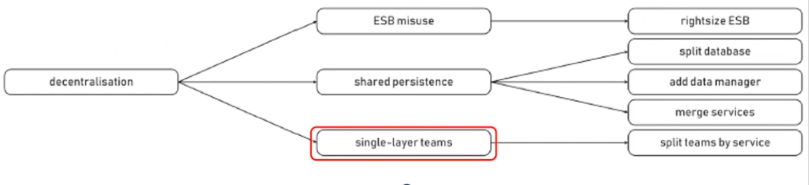

# Advanced Software Engineering

Teacher: prof. Antonio Brogi  
Accademic Year: 2020/21
[Syllabus](Syllabus.pdf)  
[Oral questions](ASE-oral-questions.pdf) (list only)

**Check out also the summaries: [short](summaries/ASE_summaries_1819_original.pdf) and [extended](summaries/ASE_summaries_1819_extended.pdf).**

## Microservices

First, let us introduce a view of a typical enterprise application.

Here, the server side is typically a monolith, it's a single executable that handles HTTP request, execute domain logic, interact with the database and send HTM views to client. That said, there are a few cons with this way of thinking:

- change made to a small part of the application require rebuilding and redeploying the **entire** monolith.

- scaling requires scaling of the entire application rather than parts of it that require more resources.

So let's start to introduce what a microservice is: micro doesn't mean small. In fact, microservices aren't small for the most part if we speak in terms of functionalities but the size of the microservice is usually related to the size of the team that manages it. A microservice architecture divide a service in many services that works tougher. They communicate RESTfully with HTTP and each one can scale as needed. A microservice is composed of this properties:

- **Service oriented:** develop applications as sets of services each running in its own container, comunicating with lightweight mechanism (via REST protocols). This it's done by HTTP request-response with resource API and by using "dumb" message bus e.g. asyncrhonous fabric like RabbitMQ (the idea is that if we have 10 services on the left and 12 on the right if the services on the left are producing messages to put on a queue, the services on the right consume on the queue). Also they are polyglots wich means that each service can be written in a different programming languages.

- **Organize services arounf business capabilities:** Usually, organization wich design systems are constrained to produce design wich are copies of the comunication structure of these organization.

with agile, these way of thinking was rearranged in the sense that teams, now, aren't meant to be composed of people that belongs to the same deparment but must be mixed. This is done because, in this way, the interaction with the other services it's way easier especially because, at some point, the teams will have to speak with each other and, this, way it's way more efficient.

- **Decentralize data management:** if we want the architecture to be easy to modify and scalable we should want a microservice. This is obtained because eache microservice is managed by one team that is indipendent from the others. To do this, they should take care of the data that they need so we mast let eache service manage its own database choosing *evenutual consistency and conpesation* instead of distributed transactions because they are very complex and, if we can implement them, they are not so efficient. In microservices there are 2 things that aren't that compatible: accessibility (whenever a data is changed it becomes available to everybody) and consistency (if we have one data wich is replicated in 2 database, if the data changes in one database then it should be changed on the other). It's important to underline that eventually in this context means that sooner or later we will have consistency.

- **Independently deployable services:** every service must be indipendent from all others, it should be able to start up without any dependencies.

- **Horizzontal scalability services:** i should be to replicate or augment the resources of a single services without interfering with others.

- **Fault resilint services:** In case of failure of a services, this should not result in a domino effect where all the other services fails too. Application need to be designed so that they can tolerate failure of services. Any service call could fail due to unavailability of supplier, client has to respond to this as gracefully as possible. This is especially difficult in distrubuted services like Netflix.This is beacuse synchronous calls between services induce multiplicative effect of downtime.

### **Netflix API (2012)**

- recieved more than 1 bilion incoming calls per day.
- several billion outgoings calls (averaging a ratio of 1:6) to dozens of underlying subsistemswith peaks of over 100k dependency request per second.
- all this across thousands of cloud instances.
- Intermmitted failure guaranteed with this many variables, eve if every dependency itself has exellent availability and uptime

The solution to this whas found in the so-called **caos-monkey** wich is a program that randomly terminates VM instances and containers that run inside the production enviroment. Still there are some cons in a microservice:

- Communication overhead
- Complexity
- When breaking the monolith, are performed the wrong cuts and we do not achieve the indipendency that we want.
- It is difficult to avoid data duplication while keeping microservices isolated.
- A poor team will always create a poor system

In the end the only motive which should push su in to microservices it's only if our application is too complex to manage in a monolith.

### **What are "squads" and "tribes" at Spotify?**

Squads are similar to scrum teams, consists of 6-12 people and are dedicated to work on one feature area. A squad is autonomous, self-organizing and self-managing and has an Agile Coach. Each squad has a mission to accomplish and is free to choose an agile methodology.

Multiple squads that work on the related feature area makes a tribe. A tribe may consist of 40-150 people and has a tribe lead responsible for creating a productive and an innovative environment.

### **What is fault-injection testing?**

Fault injection is a software testing technique by introducing faults into the code for improving the coverage and usually used with stress testing.

Usually the fault-injection testing tests the robustness of a software or a component on strange input data.

### **How can &quot;design for failure&quot; be actually implemented?**

Design for failure means that a system will never fail. In a system designed for failure every functions and component are ready to work also with unexpected data, i.e. wrong and strange inputs.

The design for failure can be tested with fault-injection testing.

### **Architectural smells**

The next querstion we ask ourselves is "how can we know when we should migrate to a microservice?". The answer to that is to identify what's called an architectural smell.

- **Multiple services in one container:** Containers (such as Docker containers) provide an ideal way to deploy microservices addressing the above requirement, if properly used. Each microservice can indeed be packaged in
a container image, and different instances of a same microservice can be launched by spawning different containers from the corresponding image. With this view,
the orchestration of the deployment and management of a microservice-based application can be performed by
exploiting the currently available support for orchestrating Docker containers. The above is the right way of using containers, placing multiple services in one container would constitute an architectural smell for the independent deployability of microservices. If two microservices would be packaged in the same Docker image, spawning a container from such image would result in launching both microservices. Similarly, stopping the container would result in stopping both microservices. In other words, by placing two microservices in the same container, these services would operationally depend one another, as it would not be possible to launch a new instance of one of such microservices, without also launching an instance of the other. If this smell occurs, the solution is to refactor the application in such a way that each microservice is packaged in a separate container image.

- **Endpoint-based serviceinteractions:** This is potentially an antipattern for horizzontal scalability. This smell
occurs in an application when one or more of its microservices invoke a specific instance of another microservice (e.g., because its location is hardcoded in the source code of the microservices invoking it, or because no load balancer is used). If this is the case, when scaling out the latter microservice by adding new replicas, these cannot be reached by the invokers, hence only resulting in a waste of resources. The most common solution is to introduce a service discovery mechanism. Such mechanism can be implemented as a service storing the actual locations of all instances of the microservices in an application. Microservice instances send their locations to the service registry at startup, and they are unregistered at shutdown. When wanting to interact with a microservice, a client can then query the service discovery to retrieve the location of one of its instances.
The other two possible solutions share the same goal, i.e., decoupling the interaction between two microservices by introducing an intermediate integration pattern. Nine of the selected studies indeed suggest to introduce a message router (e.g., a load balancer), so that the requests to a microservices are routed towards all its actual instances. Four of the selected studies instead suggest to exploit message brokers (e.g., message queues) to decouple the interactions between two or more microservices.

 

- **No API gateway:** When a microservice-based application lacks an API gateway, the clients of the application necessarily have to invoke its microservices directly. The result is a situation similar to that of the *Endpoint-based Service Interactions smell*, with the invoker being a client of the application. The client indeed interacts only with the specific instances of the microservices it needs. If one of such microservices is scaled out and the client still keeps invoking the same instance of the microservice, then we have a waste of resources. The solution to this smell is to add one API gateway to the application. The latter act as single entry points for all clients, and they handle requests either by routing them or by fanning them out to the instances of the microservices that must handle them. It is worth noting that, even if the No API Gateway smell results in a similar situation to that of the ndpoint-based Service Interactions smell, the refactorings to resolve them are different. The reason for this resides in the main dierence between the two architectural smells. The No API Gateway smell occurs at the edge of the architecture of a microservicebased application, with the clients of the application directly invoking its microservices, while the Endpoint-based Service Interactions smell occurs in between its microservices.

 

- **Wobbly service interaction:** The interaction of a microservice mi with another microservice mf is “wobbly” when a failure in mf can result in triggering a failure also in mi. This typically happens when mi is directly consuming one or more functionalities offered by mf , and mi is not provided with any solution for handling the possibility of mf to fail and be unresponsive. If this is the case, mi will also fail in cascade, and (in a worst case scenario) the failure of mi can result in triggering the failure of other microservices, which in turn trigger other cascading failures, and so on.THere are various solution to this:
    * The most common solution is the usage of a circuit breaker to wrap the invocations from a microservice to another. In the normal “closed” state, the circuit breaker forwards the invocations to the wrapped microservice, and it monitors their execution to detect and count failing invocations. Once the frequency of failures reaches a certain (customisable) threshold, the circuit breaker trips and “opens” the circuit. All further calls to the wrapped microservice will “safely fail”, as the circuit breaker will immediately return an error message to the calling microservices. The latter can then exploit the error messages returned by the circuit breaker to avoid failing themselves.
    
    * decouple the interaction between invoking and invoked microservices by exploiting a message broker (e.g., a message queue). The usage of a broker allows the invoker to send its requests to the broker, and allows the invoked microservice to process such requests when it is available. In this way, there is no direct interaction between the two microservices, and the invoker does not fail when the invoked microservice fails (as the former continues to send messages to the broker). On the other hand, the usage of message brokers is more costly compared to circuit breakers. The reason is that message brokers require to intervene on the interaction protocol between two microservices, which should start putting and getting messages to/from the broker. Instead, with circuit breakers the interaction protocol between two microservices is unaltered, as a circuit breaker simply wraps the invocation of a microservice. This is the reason why message brokers are much less discussed than circuit breakers.

    * The most discussed alternative to circuit breakers are however timeouts, which are a simple yet effective mechanism allowing a microservice to stop waiting for an answer from another microservice, when the latter is unresponsive (e.g., since it failed or due to network issues). Well-placed timeouts provide fault isolation, as the fact that a microservice is unresponsive does not create any other issue in the microservices invoking it. However, such a kind of solution might not likely to be applicable nowadays, as some of the APIs used to remotely invoke microservices have few or no explicit timeout settings

    * another alternative is the usage of bulkheads, whose ultimate goal is to enforce the principle of damage containments (like bulkheads in ships, which prevent water to flow across sections). The idea is that, if cascading failures cannot be avoided, they should at least be limited by exploiting bulkheads. More precisely, the microservices forming an application should be logically and/or physically partitioned so as to ensure that the failure of a microservice can be propagated at most to the other microservices in the same partition, by preventing the rest of the system from being affected by such failure.

 

- **Shared persistence:** This smell occurs whenever two microservices access and manage the same database, possibly violating the decentralisation design principle. There are 3 main solution to resolve this smell:

   * The most discussed solution is to actually split a database shared by multiple microservices, in such a way that each microservice accesses and manages only the data it needs. This solution is the one requiring less intervention on the microservices, as they would continue to use the same protocol to interact with the databases. At the same time, splitting a database into a set of independent databases is not always possible or easy to achieve. Also, if some data is to be replicated among the databases obtained from the split, then mechanisms for (eventual) data consistency should be introduced after the refactoring. Given the above, the split of database is recommended when the microservices accessing the same database implement separate business logics working on disjoint portions of such database.

   * The most discussed alternative is to introduce an additional microservice, acting as “data manager”. The data manager becomes the only microservice interacting with and managing the database, and the microservices that were accessing the database now have to interact with the data manager to ask for accessing and updating the data. While this solution introduces some additional communication overhead, it is considered as always applicable, and the data manager can also be enriched with additional logic for processing the data it manages.

   * Merging the microservices accessing the same database. The idea is that, when multiple microservices access the same database, this may be a signal of the fact that the application has been split too much, by obtaining too finegrained microservices processing the same data. If this is the case, then the possibility of merging such microservices is a concrete option to be evaluated.

 

- **ESB misuse:** The misuse of Enterprise Service Buses (ESB) products is considered to be an architectural smell by the microservice community. When positioned as a single central hub (with the services as spokes), an ESB may become a bottleneck both architecturally and organizationally. “Smart endpoints & dumb pipes” has been a recommended practice since the very beginnings of service-oriented architectures that regrettably has not always been followed in all SOA implementations. Such ESB abuse may lead to undesired centralisation of business logic and dumb services. The microservices community therefore (re-)emphasizes the decoupling of microservices and their cohesiveness. Whenever a central ESB is used for connecting microservices in an application, the topology should be refactored to remove the dependency on a single middleware component instance. Multiple instances should instead be used, and they should implement queue-based asynchronous messaging. The latter only permits adding and removing messages, hence forming a “dumb pipe”. The “smart” part should be left to the microservices, which implement the logic for deciding when/how to process the messages in the message broker. Additional infrastructure logic, for instance traffic management capabilities, may be placed in side cars accompanying each service. This repositioning and rectification of ESB middleware improves the decoupling characteristics of the services architecture and reestablishes the original “smart endpoints & dumb pipes” recommendations from the first wave of service-orientation.

 

 - **Signle-layer teams:** To maximize the autonomy that microservices make possible, the governance of microservices should be decentralised and delegated to the teams that own the microservices themselves. As pointed out by Zimmermann, even if this is not a technical concern, it is related to the process viewpoint due to its cross-cutting nature. The microservice community indeed strongly emphasizes the connection between architecture and organisation, especially concerning the integration of the microservices in an application. The classical approach of splitting teams by technology layers (e.g., user interface teams, and middleware teams, and database teams) is hence considered an architectural smell, as any change to a microservice may result in a cross-team project having take time and budgetary approval. This may be the case for the refactorings discussed so far. The microservice approach to team splitting is orthogonal to the above, as each microservice should be assigned to a full-stack team whose members span across all technology layers. In this way, the interactions for updating a microservice (e.g., to apply one of the refactorings discussed in this section) are limited to the team managing such microservice, which can independently decide how to proceed and implement the updates. In short, if the governance of a microservice-based is organised by SINGLE-LAYER TEAMS, this is an architectural smell. The solution is to split teams by microservice, rather than by technology layer.

### **μFreshener**
This is a web-based UI that is supposed to eliminate smells from your application allowing you to edit the applicaton's specificatons, automatically identifying architectural smells and applying architectural refactorings to resolve the identified smells. Within the applicaton the system is represented as follows:

This is a Open-source program so it's free to use to refactor microservice-based apps. It's worth noting that μFreshener works on architectural level and not a code level

## REST, SOAP/ WS-\*, WSDL

### **What is REST?**

REpresentational State Transfer: is an architectural style that defines a set of constraints to be used for creating web services. It is built directly on HTTP and provide four interaction method: GET to retrieve information, PUT to create objects, POST to update it, and DELETE to delete it. There is also a Lo-REST protocol that supports only GET and POST and uses the X-HTTP-Method-Override header to set if the POST request is really a POST or is a PUT or a DELETE request.

### **REST Principles**

- **Resource identification through URIs:** The service exposes a set of resources which identify the targets of the interaction with its clients and the resources are identified by URIs, which define global addressing space for resource & service discovery.
- **Fixed set of operations:** GET ( to retrieve current state of a resource), DELETE (to delete a resource), PUT and POST ( to create and update state of resource; PUT is idempotent and POST is not [RFC 2616])
- **Self-descriptive messages:** Requests contain enough context information to process the message. In particular,  resources are decoupled from their representation so that their content can be accessed in a variety of formats (e.g., HTML, XML, JSON, plain text, PDF, JPEG, etc.) and the metadata about the resource can be used to control caching or to negotiate representation format.
- **Stateful interactions through hyperlinks:**  Every interaction with a resource is stateless. In particular,  server contains no client state, any session state is held on the client and stateful interactions rely on the concept of explicit state transfer (through hyperlinks), using a stateless communication (HTTP)

### **How can we create/update/access resources in REST?**

Resources are created with the PUT HTTP method and updated with the POST one. The real difference between PUT and POST is that the PUT is idempotent, and the POST is not (RFC 2616). That means that multiple PUT requests have the same result that the last PUT request will have, instead multiple POST request has a cumulative result.

The access to resources is made with a GET request. The DELETE update a resource deleting it.

### **Which are the pros and cons of REST?**

PROS

- **Easy to use:** well-known standards (HTTP, XML, URI) because the necessary infrastructure has already become pervasive.
- **No additional overhead:** deploying similar to dynamic website, the effort required to build a client to a RESTful service is small because  developers can begin testing service from ordinary Web browser and there's  no need to develop custom client-side software. Thanks to URIs and hyperlinks, it is possible to discover Web resources without compulsory registration to a repository.
- **Predictable endpoints, hyperlinks navigation**
- **Efficiency:** lightweight protocol and message formats
- **Scalability** (stateless)
- **Easier and less complex than SOAP**

CONS

- **Confusion on what are the best practices for building RESTfulWeb services:** Hi-REST recommends the use of 4 verbs (GET, POST, PUT, DELETE) meanwhile  as proxies and firewalls may not always allow HTTP connections with other verbs than GET and POST, Lo-REST uses only GET for idempotent requests, and POST for everything else (with “real” verb sent with X-HTTP-Method-Override
header or hidden form field)

- **Encoding complex data structures into a URI can be challenging:** as there is no commonly accepted marshalling mechanism. E.g. idempotent requests having large amounts of input data cannot be encoded in a URI (“414 - Request-URI too long“).
- **Not easy to be extended**

### **Designing RESTful services**

To efficiently design RESTful services it best to follow some guidelines:

- Identify resources to be exposed as services
- Model relationships between resources with hyperlinks
- Define «nice» URIs to address resources
- Understand what it means to do GET/POST/PUT/DELETE for each resource (and whether it is allowed or not)
- Design and document resource representrations
- Implement and deploy on Web service
- Test with web browser

### **URI design guidelines**

- Prefer nouns to verbs

- Keep URIs short
- Use URI templates to construct and parse parametric URIs

- Use URI templates to construct and parse parametric URIs

### **What is SOAP?**

Simple Object Access Protocol: is a messaging protocol specification for exchanging structured information. It is based on XML and transported over HTTP.

### **How are SOAP messages transported?**

SOAP messages are based on XML and transported over HTTP. The SOAP envelope consists in an optional header with control information, and a body with the payload.

### **REST vs SOAP**

- REST is resource-centric, SOAP is message-centric
- REST is easy, SOAP is complex
- REST is basic, SOAP advanced
- REST is for web environments, SOAP to access objects on servers (professional/enterprise environment)
- REST navigation through hyperlinks, in SOAP there are formal contracts about objects information
- REST works also on very limited bandwidth conditions, SOAP can be used for transactions that involves multiple calls
- REST does not have the complexity of the layers of the WS-\* stack.
- Not easy to exend a RESTful Web service to support advanced functionalities in an interoperable manner.
- Various decisions that are very easy to make fo RESTful services may lead to significant development efforts and technical risks.
- If the enterprise-level features of WS-\* (transactions, reliability, message-level security) are not required, REST can provide better flexibility and control, but requires a lot of low-level coding but WS-\* provides better tool support and programming interface convenience.

In the end, REST is convenient to get (simple) services running and fro tactical, ad hoc integration over the Web (e.g mashups). WS-\* is preferable for professional enterprise application integration scenarios with longer lifespan and advanced QoS requirements.

#### Guidelines for REST

It's better to use REST when:

- Clients and servers operate on a Web enviroment.
- Information about objects doesn't need to be communicated to the client.

It's better not to use REST when:

- We need to enforce a strict contract between client and server.
- We need to perform transactions that involve multiple calls.

#### Guidelines for WS-\*

It's better to use WS-\* when:

- Clients need to have acces to objects available on servers.
- We want to enforce a formal contract between client and server.

It's better not to use WS-\* when:

- We want the majority of developer to easely use our APIr.
- Our bandwidth is very limited.

### What is WSDL?

[Pronunciation: "WiSDoL"]

Web Services Description Language: is an XML language to describe public interfaces of web services. It works really well with SOAP.

It is platform and language independent and describes a service as a set of endpoints operating on messages.

It is used to describe:

- what a service does;
- where it resides;
- how to invoke it.

It is made by an abstract interface that describes operations, parameters and abstract data type, and a concrete interface that binds the abstract interface with addresses, protocols, encodings, messaging styles (RPC or document) and concrete data structures.

### What is a request-response operation in WSDL?

Request-response is the usual messaging pattern of the client-server paradigm, in which the service receives a request and sends a response. Operations are declared as an input element followed by an output element. It is a typical RPC (Remote Procedure Call). The operation is synchronous.

The opposite exchange pattern is the one-way operation, where an endpoint receives an asynchronous call, that is an input operation not followed by an output one because the service doesn't send a response.

Finally, notification is server client and solicit-response is server-client with response client-server.

### What is a portType/port in WSDL?

The \&lt;portType\&gt; element defines a web service as a group of operations that can be performed and the messages that are involved.

In particular the portType element combines multiple message elements to form a complete one-way or round-trip operation. For example, it can combine one request and one response message into a single request/response operation. It can also define multiple operations.

### Last year's Questions

#### Which are the "communication models" of SOAP?

SOAP has two communication models:

- RPC (Remote Procedure Call) that allows client applications to call web services like objects;
- document (or message) style.

The communication can be synchronous or asynchronous.

[Check also WSDL message exchange patterns]

#### What is an abstract/concrete WSDL interface?

The abstract interface contains the declaration of messages, portTypes, and operations.

The concrete interface specifies the implementation of the abstract interface and contains the bindings, which define the message format and the protocol details.

#### Which are the "message exchange patterns" of WSDL?

- request-response (input-output operations, synchronous), is the usual messaging pattern of the client-server paradigm;
- solicit-response (output-input operations, synchronous), is similar to request-response but reverted, the server asks and the client responses;
- one-way (input-only operations, asynchronous), the client sends data to the server without requiring a response;
- notification (output-only operations, asynchronous), the server sends data to the client without a request before and doesn't wait a response.

## **User Stories**

Userstories deal with one part of the SWE life cycle wich is, actually the first, how we can elicitate reuirement from the user. This is a particularly problematic phase, because it's not always easy to get the requirements that the client want to be satisfied by the application. One of the main reason for this is that the designer of the application speak a completely different language from the client not so much as in idiomatic terms but from a view and background prospective. AS a result to this, frequently, the situation that we face it's like this:

Needles to say, when we try to elicitate the requirement, we mus t put particular attention to understand the client. But we also must keep in mind that the requirements will change during the development. Fortunately, in our help, comes Agile and its 12 principles:

1. Our highest priority is to satisfy the customer through **early and continuous delivery of valuable software**.
2. **Welcome changing requirements** even late in development. Agile processes harness change for the customer's competitive advantage.
3. **Deliver working software frequently** from a couple of weeks to a couple of months, with a preference to the shorter timescale.
4. **Business people and developers works together** daily throughout the project.
5. **Build projects around motivated individuals**.Give them the environment and support they need, and trust them to get the job done.
6. The most efficient and effective method of conveying information to and within a development team is **face-to-face conversation to conveying information**.
7. **Working software is the primary measure of progress**
8. Agile processes promote **sustainable development**. The sponsors, developers, and users should be able to maintain a constant pace indefinitely.
9. Continuous attention to **technical excellence and good design** enhances agility.
10. **Simplicity**--the art of maximizing the amount of work not done--is essential.
11. The best architectures, requirements, and designs emerge from **self-organizing teams**.
12. At regular intervals, **the team reflects on how to become more effective**, then tunes and adjusts its behavior accordingly.

### **What is a user story (for)?**

User stories, per se, are Agile but they can help us better follow the Agile principles themselves. E.g. there are 3 principles that we should keep in mind:

- **Working software is the primary measure of progress:**
- **Our highest priority is to satisfy the customer through early and continuous delivery of valuable software**
- **Simplicity--the art of maximizing the amount of work not done--is essential:**

We need to make sure to organize and track our work in a way that support this goal. We need to make sure that our work is organized and chuncked into units that represent value to the customer and we need a way to sort out what is extremely valuable from what is less important. Most teams finds that the best way to do this is to visualize their work so it is easy to see what *has been* done, what *is being* done and what *will be* done. This can be done via software or with the help of sticky notes, and take the name of **Units of Work** the simple method to rapresent this is to use simple stories that describe what the users world must look like in order to mark a story as complete (User Stories).

Users stories help to better understand the customers' and stakeholders' needs and provide a software that satisfy the requirements. Them also simplify the development and help to provide working software earlier and faster.

Each user story is a chunk of work that represent value for the customer and has this format:

Development efforts driven by stories that represent our understanding of user needs, support Agile principles and fosters good development practices, whereas stories that violates those principles will hinder good development practicies and, therefore, increasing the quelity of our stories will make the rest of our development process more efficient. The stories must be written from the user's point of view and talks about thing form the user's prospective. The latter is very important because we're going to define our progress based on giving the users the ability to do someting valuable with the software that they were not able to do before. In that sense, if we write stories that aren't creating business value for the customer we're explicitly doing work that we said that isn't going to count as progress.

Developers should think about application the way the users think about it, i.e. in terms of the behavior the find valuable. So, they have to build software incrementally, as slices of functionality.

### **What is the priority of a user story?**

Each user story has a priority that helps developers to work first on the main functionality of the software. A low priority value represents the first things needed in the software to start using it. As soon as the priority increases the user stories contain units of works less important, such as optional and advanced feature. The priority is assigned by the stakeholders, so that represent what is more important for them.

### **What is the effort/size of a user story?**

A good user story should not take more than 2 days. Otherwise, it represents an epic and is necessary to split it in simpler stories. An epic is a big user story that has been splitted in smaller ones or a set of user stories that can be grouped in a single functionality. Its development may require more than one sprint but all the user stories in the epic are usually assigned to the same team.

# OLD

### What is Git/GitHub?

Git is the widely used version control protocol, and GitHub the most popular service that implements git.

It allows upload code directly from the command line and organize it in repository. Each repository can be private or public (open source) and have some collaborators that cooperate to the published code.

Each bunch of work is incapsulated in a commit, that is pushed on the server. Collaborators can clone the project locally and pull the latest commits from the server to keep the local version of the project updated. To keep the development of each feature isolated developers can works on different branches and merge the modification on the master only when is totally implemented.

Is also possible to fork an existing repository into another one and make pull request to ask the owner of the repository to add the proposed changes.

### What is Flask?

Flask is a microframework for Python that helps to create webserver in a few steps.

### What is the Model-View-Controller pattern?

It Is a pattern used to separate application's concerns.

The model represents an object. It can also have logic to update controller if its data changes.

The view represents the visualization of the data that model contains.

The controller acts on both model and view. It controls the data flow into model object and updates the view whenever data changes. It keeps view and model separate.

### What is Celery?

Celery is an asynchronous task queue based on distributed message passing.

It is focused on real-time operation but supports scheduling as well.

Tasks can execute asynchronously (in the background) or synchronously (wait until ready).

### What is / How can you use OpenApi 2.0?

The OpenAPI Initiative (OAI) was created by a consortium of industry under the Linux Foundation with the aim of standardizing on how REST APIs are described with a vendor neutral description format.

The APIs description can be written in either JSON or YAML and describes addresses, ports, endpoints and paramethers.

### Last year's Questions

#### What is "horizontal scalability"?

Is the ability to scale only one microservice having as instances as you want without need to change the way the other microservices interact with it.

#### How "small" should a microservice be?

Size doesn't really matter. However, it is as small as the team behind it, and the team is usually a "2 pizzas team", that means a team that can be fed with 2 American pizzas, usually 8 people.

## Testing

### NOTES

- Validation testing: to prove that the software does what we expect it to do
- Defect testing: find unwanted changes

- Software verification: check if software meets requirements
- Software validation: check if software meets customer's expectations

- Unit test: the single module/function/class
- Component test: interfaces between "units"
- System test: interactions between components

Testing can only show the presence of errors, not their absence.

### What is development/release/user testing?

Development testing consists in testing the system during the development to easily discover bugs and defects. Examples of development testing are unit testing and component testing.

Release testing are tests performed by a separate team that tests the entire application to check if meets the stakeholders' expectations and the system requirements. Hence, they are not intended to found bugs, that is a responsible of the development team. An example of release testing is system testing, but also requirements-based testing, scenario testing and performance testing.

User testing are performed by a selected bunch of users that test the application in their environment. Examples of user testing are alpha and beta testing and acceptance testing (involves the customers and the stakeholder).

### What is partition testing?

Partition testing is a strategy for unit testing that consist in partioning the input (and output) data in classes of equivalence with common characteristics, for which the program works in a comparable way. For each partition are performed some tests on the boundary values and the ones in the middle of the partition.

### What is test-driven development?

Development methodology in which tests are written before the code. The aim of the code is to pass the tests. The code is developed incrementally and there isn't a move to the next increment until the previous one doesn't pass the tests.

This approach was introduced as part of an agile methods such as Extreme Programming.

It simplifies the debugging, increases the coverage of tests and permits regression testing (check that new edits don't brake old functionality).

### What is load testing?

Load testing is a kind of Performance Testing which determines a system's performance under real-life load conditions. This testing helps determine how the application behaves when multiple users access it simultaneously. This testing usually identifies the maximum operating capacity of an application.

### Last year's Questions

#### What is CI?

CI stands for Continuous Integration and is a development practice where developers integrate code into a shared repository frequently, preferably several times a day. Each integration can then be verified by an automated build and automated tests.

## Splitting the Monolith

### When and where to start splitting a monolith codebase?

A monolith should be splitted when the effort to rebuild and redeploy it is becoming very expensive. For example, when the cohesiveness changes into a big amount of unrelated code and component kept together, or when small changes have a big impact on the monolith involving a big effort to test, fix and deploy it again.

The monolith braking should start from the seams, finding components that can be shared with other contexts.

The refactoring should be done incrementally, increasing also the testing, and gradually split more and more. At each step code left over may help to identify new bounded context.

### How to split databases? (e.g., how to break foreign key relationships?)

A big database can be splitted according to the microservices competence. Each database table (or a set of strongly related tables) can became a single microservice. The foreign keys must be converted in checks across these microservices.

Shared static data, for example (almost read-only) database tables shared by many microservices, can be duplicated maintaining the (eventual) consistency between each copy.

Shared mutable data, i.e. databases that are frequently updated, should be converted in a separated microservice.

Split a monolith that has a database requires to split first the database, and then the monolith code.

### What about transactions when you split?

Transactions are useful to ensure consistency. In particular the all-or-nothing transaction ensure that if one or more operation in a transaction fails all the operation in the transaction already performed will be reverted.

Vulnerabilities of transactions are that if the transaction manager goes down or a component involved in the transaction doesn't respond everything blocks. Furthermore, in some cases a component can fail also after voting.

The solution is eventual consistency, that means that "sooner or later" it will be consistent. A possible implementation of eventual consistency is the SAGA pattern (see below).

### What is the SAGA pattern?

SAGA is a pattern for eventual consistency. All atomics operations are accumulated in a queue.

The saga execution controller takes the first one and start doing the operation in parallel according with the risk.

If one operation fails, there are two recovery modes:

- Backwards: undo all the successful operations;
- Forwards: retry until all re successful (operations must be idempotent).

### What is eventual consistency?

Eventual consistency means that "sooner or later" it will be consistent. It is a good compromise for when the system must be consistent but is too much expensive to have an atomic operation, e.g. when it avoids parallelism. Eventual consistency guarantee that the system will be consistent for sure, but it requires a bit of time to have it.

A possible implementation of eventual consistency is the SAGA pattern (see above).

### What is a (event) data pump?

Data pump pumps data from a primary database to a second one used for example for reporting.

Usually the secondary database needs to compact data and doesn't need the data to be always up-to-date.

A (wrong) strategy to populate the replica database is transfer data through APIs but is not such a good practice because the exposed APIs may be not designed for huge transactions and may not scale well. Data pumps pushes data directly from the primary database to the replica.

Event data pump doesn't pump data periodically but emits event every time a data of its pertinence is updated. The subscriber to the events updates its data autonomously.

Events data pumps have the advantages that the data pump is not a pertinence of the database service team and that the data is updated faster than with periodical backups. The cons is that it may not scale well.

## Cloud-based Software Engineering (Cloud Computing & Docker)

### What are the service/deployment models of cloud computing?

Service Models are IaaS, PaaS and SaaS.

IaaS stands for Infrastructure as a Service, in that case the vendor rent you an infrastructure, e.g. a VPS or a bunch of servers, on which you can build your own services on your preferred platform. The advantage of IaaS is that you can scale the computing power and the resources you need as you want, simply paying more. You don't have to invest in buying and managing the entire infrastructure.

PaaS stands for Platform as a Service. Examples of PaaS are Azure, Google Cloud Computing or AWS. They give you not only the infrastructure but also a platform on which you can run the software. This avoid you to manage the platform, just take care of the software taking advantage of the features provided by the platform. The disadvantage of the PaaS is that it involves more the problem of lock-in.

In SaaS is rented the software directly, e.g. Google Drive or Google for Enterprise, Microsoft Office 365, and so on. You just choose the software you need and pay for this service. You don't have to manage anything, the provider manage takes care of everything for you.

Deployment models are private, public and hybrid cloud.

In private cloud you have a high control but also high costs and low scalability. Instead public cloud costs less and scale more, but you have less control. The hybrid cloud is the best option for most companies, because they can store and manage sensitive information in private cloud and take advantage of the low costs and high scalability of public cloud to offer services to the customers.

### Which is an example of (disruptive) business model exploiting cloud computing?
// TODO

### What is a virtual machine? / What is server virtualization?

A virtual machine is where you actually install the OS you are used to install, and the Apps. It is an abstract machine that use the resource of the host physical machine on which runs.

Virtualization is an abstraction layer between physical server and the OS you would normally install, i.e. the layer between the host machine and the VMs.

Virtualization is implemented through a hypervisor. The type 1 hypervisor is loaded directly on the hardware, the type 2 hypervisor runs on a host OS and is less performant. Usually datacenter uses type 1, instead the type 2 is usually used by desktop users.

### What are Heroku's dynos (for)?

The Heroku dynos are container that runs on the Heroku platform. We can call it Container as a Service, you just incapsulate your software in a container and you can run and scale it on Heroku. Them are an example of PaaS, in which the platform is the container virtualization.

### What is FaaS?

FaaS stands for Function as a service that is a category of cloud computing services that provides a platform allowing customers to develop, run, and manage application functionalities without the complexity of building and maintaining the infrastructure typically associated with developing and launching an app. Is also called "serverless" architecture and is typically used when building microservices applications.

The difference between FaaS and PaaS is that in PaaS you get the entire platform, in the FaaS only the tools to run a specific service, e.g. a Node.js FaaS allows to run only a Node.js application.

An example of FaaS provider is AWS lambda, instead AWS is a PaaS.

### How to avoid/reduce cloud lock-in?

Vendor lock-in makes a customer dependent on a vendor for products or services, unable to use another vendor without substantial switching costs.

The lock-in problem grows with the abstraction of the service, that means that is low with IaaS and very high with SaaS.

Is not possible to totally avoid the lock-in problem when using PaaS and SaaS, but there are many techniques to reduce it:

- Choose carefully the provider, thinking carefully before using a proprietary service and planning an exit strategy;
- Ensure the portability of data using unified interfaces and choosing open standards and open-source technologies;
- Use loosely coupled architecture, i.e. a microservices architectures distributed on multiple clouds using API REST, containers and DevOps tools.

### What is a container/image/volume?

A container is an isolated user-space instances obtained using the filesystem isolation of host OS kernel. Each container runs an instance of an image and can be attached to a volume.

An image is made of an application and the binary and libraries that the application need. It can consist of multiple layers (see What is image layering in Docker?). An image instance is called container, and for each image there can be many running containers (instances).

A volume is a permanent storage unit (it can be a folder or a virtual drive i.e. a file) attached to a running container. Indeed, when a container stops (e.g. fails, ends, or is stopped), the storage editing is discarded.

### What is the difference between a virtual machine and a container?

Containers are multiple isolated user-space instances using the filesystem isolation of host OS kernel. That means that each process on a container runs natively on the host machine in an isolated mode.

The advantage is that this technique eliminates the overhead of the hosted OS, running a software without having to run an entire OS. That means a lighter, faster and easier to build service.

Disadvantages are that we cannot run container for OS different from the host one as in a Virtual Machine and it can be less secure because there is less isolation than in a VM.

### What is image layering in Docker?

In Docker an image can be build from scratch, starting from source files, or editing an existent one, e.g. installing Node.js on an Ubuntu image. During the latter process, at each step is generated a layer, so the result image is a composition of layers. That allow the reuse of layers, so that the data shared by different images is downloaded (and kept in memory) only one time.

### What is the effect of docker run/commit?

Docker run put in run an image creating a container, that is a running instance of that image.

Docker commit saves a running container into an image, so that we can reuse it. It is useful for distributing images obtained by editing a container, for creating snapshot or to have many instances of an image (duplicate a container).

### Last year's Questions

#### What is Docker?

Docker is an open source tool designed to make it easier to create, deploy, and run applications by using containers. Containers allow a developer to package up an application with all of the parts it needs, such as libraries and other dependencies, and ship it all out as one package.

Unlike a virtual machine, rather than creating a whole virtual operating system, Docker allows applications to use the same Linux kernel as the system that they're running on and only requires applications be shipped with things not already running on the host computer. This gives a significant performance boost and reduces the size of the application.

## Business Process Modelling (BPM)

### NOTES

BPMN: Business Process Model and Notation, is a graphical notation for business process modeling.

### What is a parallel/exclusive/inclusive gateway in BPMN?

Parallel gateway act as an AND: all branches are taken and processed in parallel, then joined when all are completed.

The Exclusive gateway act as a XOR: only one branch is taken.

An inclusive gateway split the token into one or more branches depending on formula in each flow and join it when all active input branches are completed.

### What is an error event in BPMN?

An error event is an interrupting event attached to a process. When this event occurs, the process is interrupted, and the event branch is executed instead.

Different from the error event, the escalation event is executed without interrupting the process, in parallel.

### What is Camunda?

Camunda is an open source platform for workflow and decision automation that brings business users and software developers together. Through Camunda is possible to automate a BPM using pre-prepared decision schemes or associating external workers through APIs.

### Can you describe the usage patterns of Camunda?

First a we draw the BPM diagram with Camunda Modeler, then we deploy it on Camunda. Then potential workers must be developed. Finally, we can create the process from the task list and monitor it.

### What is the difference between orchestration and choreography?

In the orchestration there is a centralized orchestrator, in choreography them are self-organized and self-orchestrated.

### What is a workflow net?

A workflow net is an extension of Petri nets and is a technique for specifying business processes in

a formal and abstract way. It has a graphical representation that helps to visualize the workflow and includes many supporting tools to analyze properties.

### How can we model BPMN parallel/exclusive/inclusive gateways with workflow nets?
#### Parallel gatway

#### Exclusive gatway

#### Inclusive gatway

### What is a live/bounded/sound net?

A Petri net is live if and only if for every reachable state M' and every transition t, there is a state M'' reachable from M' which enables t.

A Petri net is bounded if and only if for each place p there is a natural number n such that for every reachable state the number of tokens in p is less than n ("is not a black hole").

A workflow net is sound if and only if is live and bounded.

A workflow net is sound if and only if every net execution starting from the initial marking eventually leads to the final and every transition occurs in at least one net execution.

## Fog Computing

### What is fog computing?

Fog computing is a middleware between the cloud and the IoT devices. Its purpose is to aggregate data coming from the billions of IoT devices to reduce the traffic from and to the cloud.

The main advantages are:

- Low latency
- Bandwidth saving
- Location and context awareness
- Geo-distribution
- Mobility

### What is / how difficult is the "component deployment problem" in fog computing?

As for the cloud when choosing a fog node is important to put attention to the QoS and the trust of the provider. This is more difficult because of in fog computing the location of the node has an important relevance. Hence, there are many factors to take care of when deploying a fog computing layer. The mains are:

- QoS of a node
- Location and context-awareness of a node
- Link/node failure
- QoS and fault tolerance of my service/infrastructure
- Reduce/minimize resource consumption
- Keep costs affordable

### What is FogTorch?

FogTorch is a tool for probabilistic QoS-assurance and resource consumption estimation of eligible deployments of Fog applications. It helps in planning a QoS-, context- and cost-aware deployment of fog applications through models and algorithms, a Monte Carlo simulation and a cost model.

### What is SecFog?

SecFog is a tool developed by the SOCC group of the CSD of University of Pisa for deploying fog application according to the security policies.

To each component and to the application are assigned security requirements. Similarly, to each node is attached a node descriptor and to each infrastructure operator a trustworthy level.

The simulation is written in ProbLog2 that allows to assign a probability to a predicate. Running the simulation we can check the best deployment to minimize the costs while respecting the QoS and security requirements.
